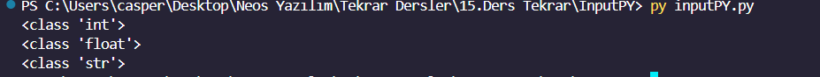

<h1><i>INPUTS PYTHON</i></h1>

It prompts the user to enter something using the input() function and stores the input in the variable name. Then, it prints the value of name along with its data type using f-string formatting.

It initializes a variable number with the string value "123". Then, it converts number to an integer using the int() function, prints its data type, converts it to a float using the float() function, prints its data type again, and finally converts it to a string using the str() function and prints its data type once more.

